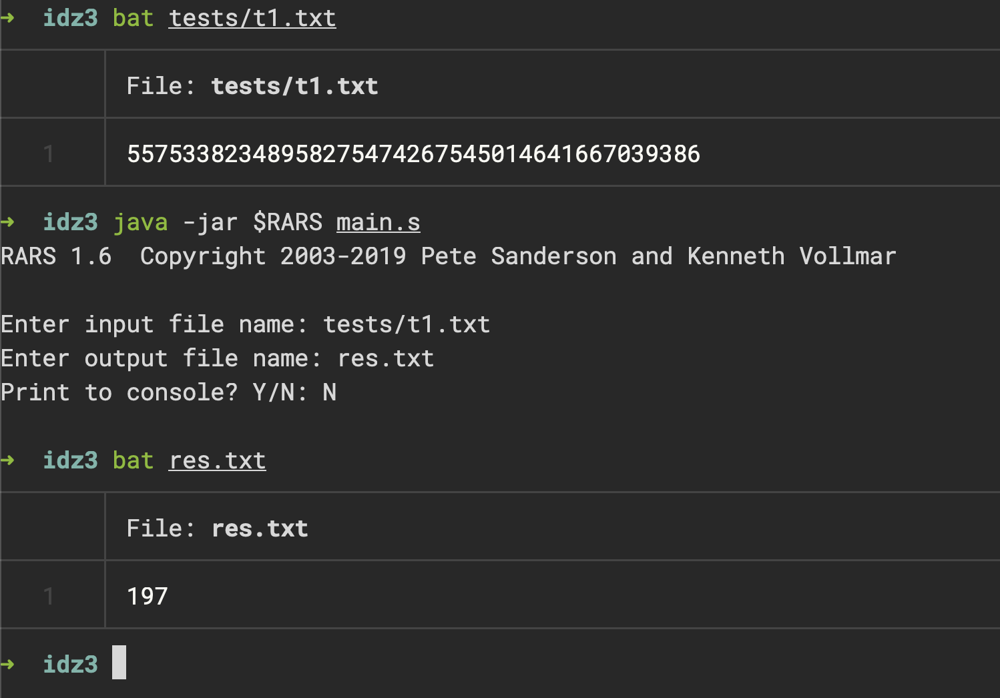
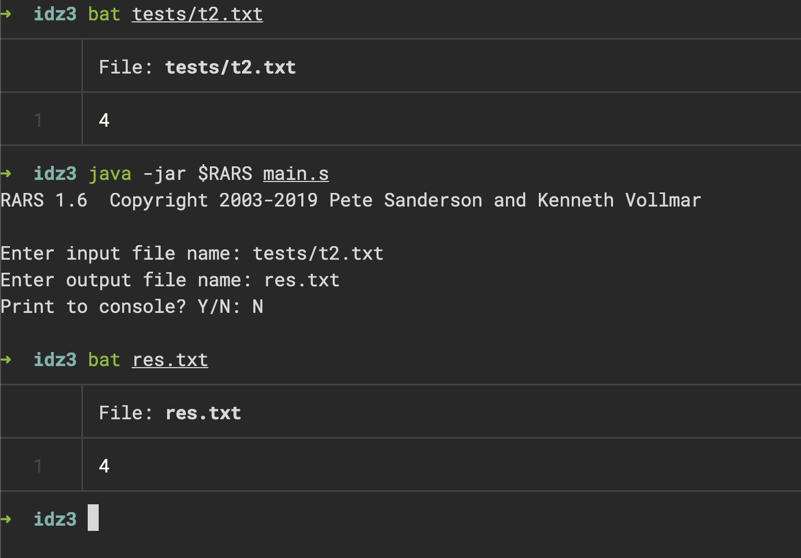
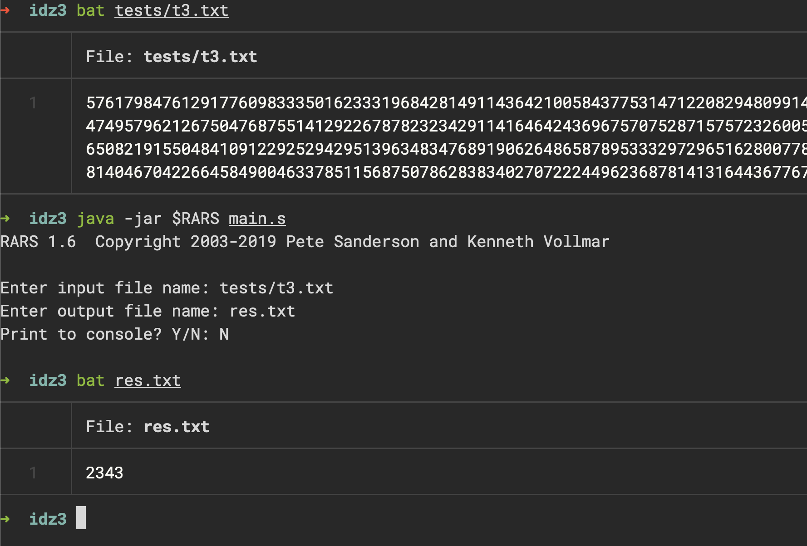
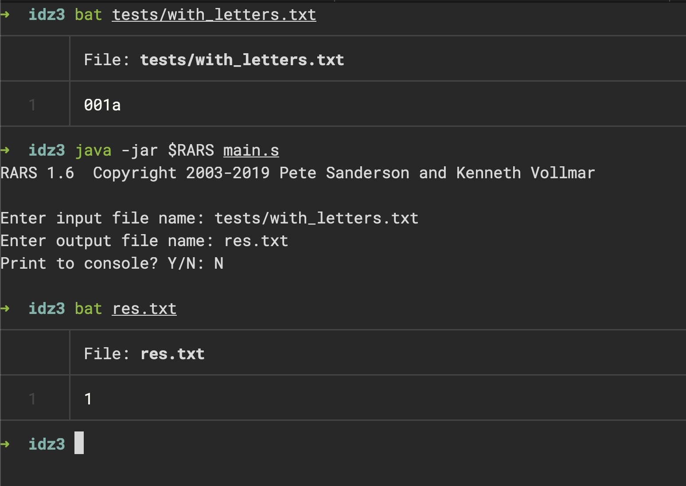

# ИДЗ-3 Печенев Платон, БПИ-2310, вар 21

Программа разделена на файлы `file.s` (**макросы** для работы с файлами), `sring.s` - вспомогательные **макросы** для работы со строками. В `main.s` располагается основная программа, а также подпрограмма `solve` для обработки данных и обертка над ней. При необходимости можно вывести данные в консоль

## Небольшие данные

## Данные поменьше

## Данные побольше

## С буквами

